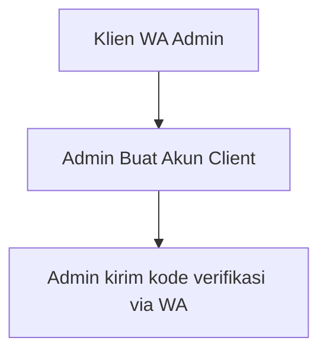
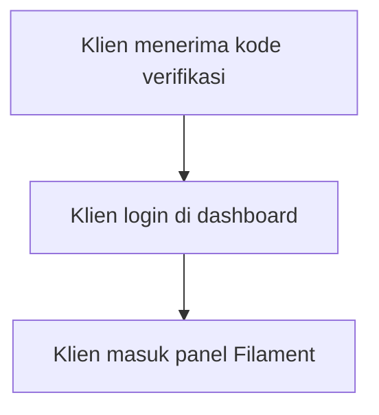
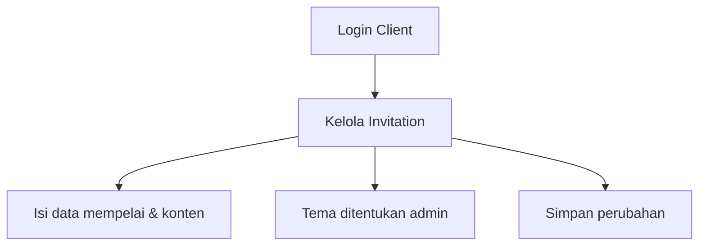
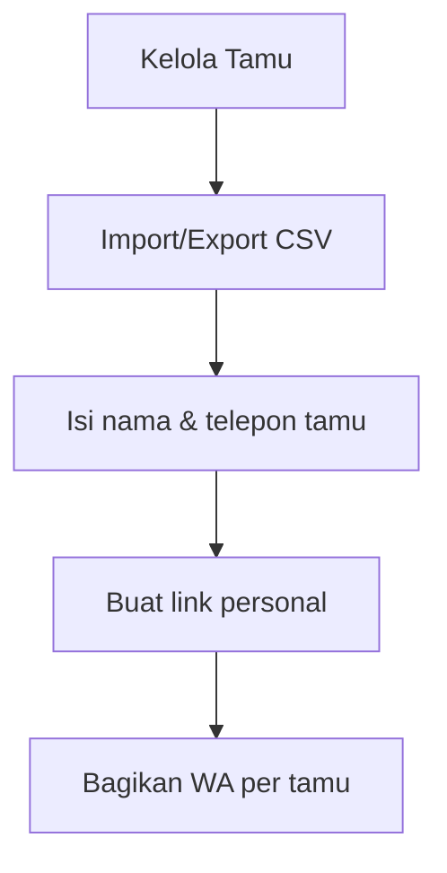
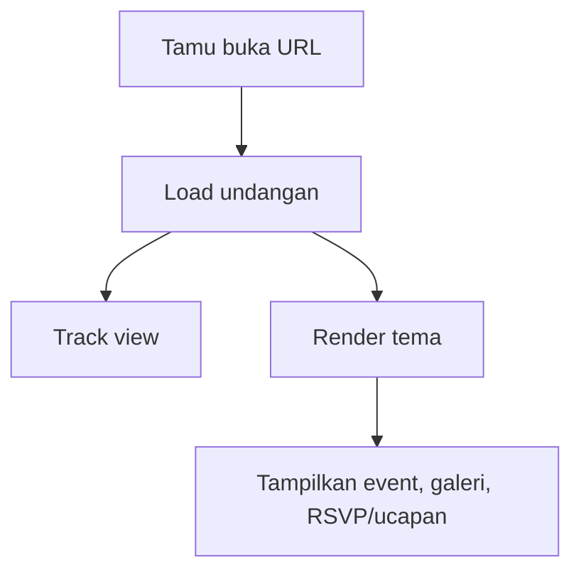
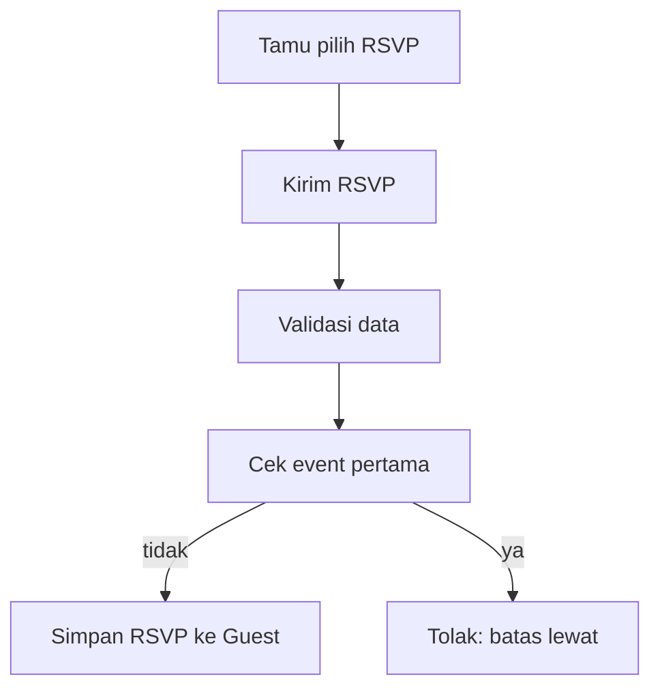

# AturAtur — Platform Undangan Digital (Laravel + Filament)

AturAtur adalah platform untuk membuat undangan pernikahan digital dengan **link personal per tamu**, **RSVP online**, **ucapan/tulisan doa** yang bisa disetujui, serta **galeri foto** dan informasi acara. Admin mengelola paket, tema, dan akun klien; klien mengelola undangannya di dashboard; tamu mengakses undangan melalui link publik.

> Catatan: aplikasi ini menggunakan **panel Filament** untuk Admin dan Client (bukan route blade manual untuk CRUD-nya).

---

## Fitur Utama

### Untuk Klien (Client)
- Dashboard undangan (kelola data mempelai, konten, musik, alamat, dan pengaturan undangan)
- Menetapkan **tema** (ditentukan admin melalui paket, klien hanya melihat/disabled)
- Kelola **events/acara** (tanggal, jam, tempat) (melalui resource yang sesuai)
- Kelola **tamu** per undangan
  - Kolom grup (contoh: keluarga/teman/rekan kerja)
  - RSVP status: `pending`, `hadir`, `tidak_hadir`, `ragu`
  - Jumlah tamu yang hadir (`guest_count`)
- **Salin link** undangan per tamu
- **Bagikan WhatsApp** per tamu (menghasilkan URL `wa.me/...?...` berisi teks undangan)
- Kelola **hadiah/gift** untuk paket non-basic
- Upload **foto cover** dan **galeri**
- Ucapan tamu terlihat setelah disetujui (melalui approval flow)

### Untuk Tamu (Public)
- Akses undangan melalui URL berbasis `slug` undangan
- (Opsional) buka halaman khusus tamu menggunakan `guestSlug`
- Konfirmasi RSVP dengan status dan jumlah tamu
- Mengirim ucapan/doa
- Download kalender acara dalam format **.ics**

### Untuk Admin
- Mengelola akun (role `admin` dan `client`)
- Mengelola paket, tema, dan pengaturan yang dibutuhkan aplikasi
- Memberikan akun klien dengan **verification code**
- Menentukan tema/paket untuk klien

---

## Tech Stack

- **Backend:** Laravel 12
- **Admin/Client Panel:** Filament
- **Frontend:** Tailwind CSS v4, Vite, vanilla JS
- **Database:** MySQL
- **Storage:** Local disk (`storage/app/public`) dengan `php artisan storage:link`

---

## Arsitektur Ringkas

Komponen penting aplikasi:
- **Controllers (Public):**
  - `app/Http/Controllers/LandingController.php` untuk halaman landing/katalog tema/cara kerja
  - `app/Http/Controllers/InvitationPublicController.php` untuk halaman undangan publik, RSVP, ucapan, dan download kalender
- **Middleware:**
  - `app/Http/Middleware/TrackInvitationView.php` untuk menghitung view undangan per hari
- **Filament Panels:**
  - Admin: `app/Providers/Filament/AdminPanelProvider.php` (path `/admin`)
  - Client: `app/Providers/Filament/ClientPanelProvider.php` (path `/dashboard`)
- **Model domain:***
  - `Invitation`, `Guest`, `Event`, `Photo`, `Wish`, `Order`, `Theme`, `Package`, dll.

---

## Alur Aplikasi (End-to-End) + Flowchart

### 1) Proses Pemesanan (Konversi/WA)
1. **Klien WA admin** untuk order paket.
2. **Admin membuat akun klien** di panel admin
   - Role: `client`
   - Sistem membangkitkan `verification_code` saat create user jika kosong
   - Admin dapat mengisi `package_id`, `theme_id`, dan `expires_at` (sesuai resource yang tersedia)

**Flowchart (teks):**




### 2) Login & Aktivasi Klien
1. Klien login ke panel client (`/dashboard`).
2. Klien menggunakan kredensial yang diberikan admin.

**Flowchart:**




### 3) Pembuatan Undangan oleh Klien (CRUD di Filament)
1. Klien mengisi identitas undangan:
   - `title`, mempelai pria/wanita, slug (slug `Invitation` diset/immutable dari resource)
2. Tema terkunci/diload dari admin melalui relasi `theme_id`.
3. Klien mengisi konten:
   - `cover_photo`, `opening_quote`, `love_story`, `music_url`
4. Klien mengatur amplop digital:
   - `bank_name`, `bank_account`

**Flowchart:**




### 4) Manajemen Tamu + RSVP Link Personal
1. Klien import/export tamu.
   - Export CSV tersedia (route internal `guests.export`)
   - Import CSV tersedia di resource Guest (file upload dan parsing CSV)
2. Klien menetapkan status RSVPs tamu (tersimpan saat tamu mengisi, atau di set/diolah jika ada fitur tambahan).
3. Klien membagikan link undangan per tamu:
   - Salin link per tamu (copyable)
   - Bagikan via WhatsApp (menghasilkan URL `https://wa.me/<phone>?text=...`)

**Flowchart:**




### 5) Tamu Membuka Undangan (Public)
1. Tamu membuka URL:
   - Undangan (tanpa guest): `/{slug}`
   - Undangan (dengan guest): `/{slug}/{guestSlug}`
2. Middleware `track.view` menaikkan counter `view_count` maksimal 1x per hari per undangan.
3. Sistem memilih tema berdasarkan `invitation.theme`.
   - Jika theme tidak ditemukan, fallback ke tema aktif pertama.
   - Fail-safe fallback ke `themes.elegant-white.show`.

**Flowchart:**




### 6) RSVP & Ucapan
#### RSVP
1. Tamu mengirim RSVP ke endpoint `POST /rsvp/{guest}`
2. Validasi:
   - `rsvp_status` ∈ {`hadir`,`tidak_hadir`,`mungkin`}
   - `guest_count` integer 1..10
3. Sistem cek batas waktu:
   - jika event pertama sudah lewat, menolak dengan error
4. Update kolom pada `Guest`:
   - `rsvp_status`, `guest_count`, `rsvp_at`

**Flowchart:**




#### Ucapan (Wish)
1. Tamu mengirim ucapan ke `POST /wishes/{invitation}`
2. Validasi:
   - `sender_name` max 150
   - `message` max 2000
3. Sistem membuat `Wish` dengan `is_approved = false`
4. Ucapan tampil setelah admin menyetujui (approval flow ada di resource admin/client terkait).

---

## Flow Data & Struktur URL

### Public Routes (inti)
- Landing:
  - `GET /`
  - `GET /tema`
  - `GET /tema/{slug}` (theme demo)
  - `GET /cara-kerja`

- Public Invitation:
  - `GET /{slug}` → tampilkan undangan
  - `GET /{slug}/{guestSlug}` → tampilkan undangan khusus tamu (guest)
    - Middleware: `track.view`

- RSVP & Wish:
  - `POST /rsvp/{guest}`
  - `POST /wishes/{invitation}`

- Kalender:
  - `GET /calendar/{slug}/{event}` → download `.ics`

### Panel Filament
- Admin panel: **/admin**
- Client panel: **/dashboard**

---

## Detail Entitas (Model) yang relevan

### Invitation
- Menyimpan data konten undangan dan data mempelai.
- `slug` dipakai untuk URL publik `/{slug}`.
- relasi:
  - `events()`
  - `photos()`
  - `guests()`
  - `wishes()`
- Hooks:
  - saat saving, `groom_slug` dan `bride_slug` otomatis dibentuk dari nama mempelai.

### Guest
- Menyimpan identitas tamu per invitation.
- `slug` dipakai untuk URL tamu `/{invitation.slug}/{guest.slug}`.
- Field RSVP:
  - `rsvp_status`, `rsvp_at`, `guest_count`
- Relasi:
  - `invitation()`
  - `wishes()`
  - `gift()`

---

## Setup & Instalasi (Clone & Jalankan Lokal)

### Prasyarat
- PHP sesuai requirement Laravel
- MySQL
- Node.js (untuk Vite build)

### Langkah Setup
```bash
# 1) Clone repo
git clone <url-repo>
cd aturatur

# 2) Copy env
cp .env.example .env

# 3) Install dependencies PHP
composer install

# 4) Generate key
php artisan key:generate

# 5) Konfigurasi database di .env
# DB_DATABASE, DB_USERNAME, DB_PASSWORD

# 6) Migrasi + seeding
php artisan migrate --seed

# 7) Storage link (untuk akses file upload)
php artisan storage:link

# 8) Install & build frontend
npm install
npm run build

# 9) Jalankan server
php artisan serve
```

### Akses Panel
- Admin: `http://127.0.0.1:8000/admin`
- Client: `http://127.0.0.1:8000/dashboard`

---

## Akun Default (jika seed digunakan)

Akun default dapat dibuat oleh seeder. (Detail email/password dapat berbeda tergantung seed yang berjalan.)

> Jika Anda menjalankan `php artisan migrate --seed`, cek AdminSeeder/DatabaseSeeder untuk kredensial yang tersedia di database.

---

## Export/Import Tamu (CSV)

### Export
- Tersedia di resource Guest.
- Mengunduh CSV berisi kolom: Nama, Telepon, Grup, RSVP, Jumlah Tamu, Hadiah Type/Jumlah/Keterangan.

### Import
- Upload CSV pada action import di resource Guest.
- Format CSV: header baris pertama dilewati.
- Sistem membuat `slug` unik untuk tiap tamu.

---

## Customisasi Tema

- Tema tersimpan pada `Theme`.
- Resource invitation menampilkan tema dari admin dengan `theme_id`.
- Public render theme menggunakan view path: `themes.{themeSlug}.show`.
- Ada fallback untuk memastikan rendering tetap berjalan jika theme view tidak ditemukan.

---

## Catatan Implementasi Keamanan & Validasi
- RSVP dan Wish menggunakan validasi request.
- RSVP dibatasi menggunakan throttle:
  - `throttle:5,1` untuk RSVP
  - `throttle:3,1` untuk wishes
- Ucapan `Wish` dibuat `is_approved=false` agar tidak otomatis tampil sebelum disetujui.

---

## Pengembangan / Kontribusi

Struktur folder penting yang dipakai (ringkas):

- `app/Http/Controllers/` → controller untuk landing & public invitation
- `app/Http/Middleware/` → `TrackInvitationView`
- `app/Models/` → entitas domain (Invitation, Guest, Event, Photo, Wish, Theme, Package, Order, dll.)
- `app/Filament/` → panel admin/client dan resource CRUD
- `resources/views/themes/` → template tema untuk rendering publik

---

## Informasi Tambahan untuk Reference GitHub

Untuk keperluan dokumentasi, istilah yang dipakai:
- **Invitation**: undangan utama (menghasilkan URL `/{slug}`)
- **Guest**: tamu undangan (menghasilkan URL `/{slug}/{guestSlug}`)
- **Event**: jadwal acara (ditampilkan di undangan & diunduh sebagai kalender)
- **Wish**: ucapan/doa tamu yang menunggu approval
- **Theme**: template tampilan undangan (view Blade)

---

## Daftar Teknologi & Link
- Laravel: https://laravel.com/
- Filament: https://filamentphp.com/
- Vite: https://vitejs.dev/
- Tailwind CSS: https://tailwindcss.com/

